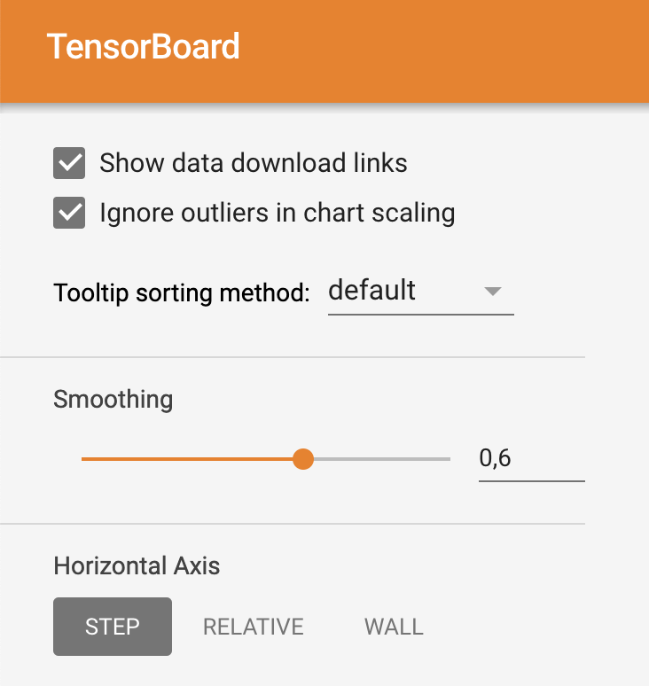

# Här är mina resultat hittils:

I den här filen ska ni beskriva:
- Era experiment
- Era slutsatser

## Svar till frågor på del 7:
# a.
- Det går snabbare om man ökar hastigheten (lr) till en viss gräns. I vårat fall så ger värdet lr=0.1 den snabbaste tiden. Men när vi testar med högre värden såsom 0.5 och 10.0 så    ger inte det någon snabbare tid. 

- Det verkar som att det finns en gräns för hur högt optimalt värde på lr man kan ha. När man sätter ett högt värde så påverkas inte träningstiden så mycket men värdena på epoch_loss  och epoch_accuracy blir mycket sämre.

-  I figurerna: "a_epoch_accuracy" och "a_epoch_loss" så kan man tydligt se en tydlig skillnad på värdena. De två linjer som avviker sig väldigt mycket ifrån de andra linjerna är resultaten då lr är satta till 10.0 och 1000.0

# b. 
- Ju mer man sänker värdet på batch_size desto bättre/önskvärda blir värdena, dock så tar träningen längre tid.

- I figurerna: "b_epoch_accuracy" och "b_epoch_loss" så ser vi resultaten på experimentent med olika batch_size värden. De olika värden som testats är: 256, 200, 150 och 100.

# c.
- Träningstiden mellan de olika modellerna skiljer sig väldigt mycket. Träningen för "convolutional model" tog ungefär 9 gånger längre tid att träna än den "vanliga" modellen.

- Anledningen till varför träningstiden är längre för convolutional model är för att den analyserar en bild mycket djupare än ett normalt nätverk och innehar ett såkallat convolutional layer som är bra för att fånga "lokal"information (t.ex. grannpixlar i en bild eller omgivande ord i en text) samt för att minska modellens komplexitet. Kort sagt kan man säg att modellen analyserar bilden bit för bit i med avsikt att på att få ett bättre resultat på vad det egentligen är på bilden. Detta leder i sin tur att analysering samt träningen tar längre tid att genomföra än det gör för den vanliga modellen.

# d.
- På bilderna "d_moved_data", "d_rotated_data" och "d_test_data" kan man se skillnaderna på resulteten mellan den normala och konvolutionella modellen.
    - Vänstra delen på bilderna: Normala modellens resultat.
    - Högra delen på bilderna: Konvolutionella modellens resultat.

- Resultaten mellan de olika testseten skiljer sig ganska så markant. Anlendningen till varför man kan se en skillnad på resultaten är för att datan som modellerna får in som input har olika format. Datan som är "normal" är enklare för modellerna att tolka och förutsäga till skillnad mot siffrorna som exempelvis är roterade.

- Skillnaderna på resultaten (Average accuracy) mellan de olika datasetsen är inte riktigt samma för modellerna.
    - Skillnad på resultat mellan moved och rotated:
        - Normal Model: 62.15
        - Convolutional Model: 68.57
    - Skillnad på resultat mellan rotated och test:
        - Normal Model: 18.84
        - Convolutional model: 10.94

## Glöm inte!
Glöm inte att ha med figurer:

